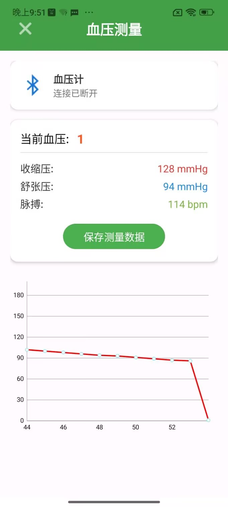
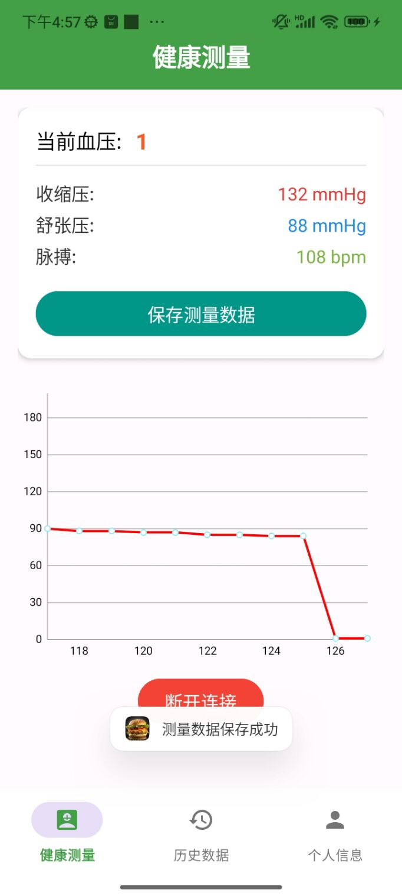
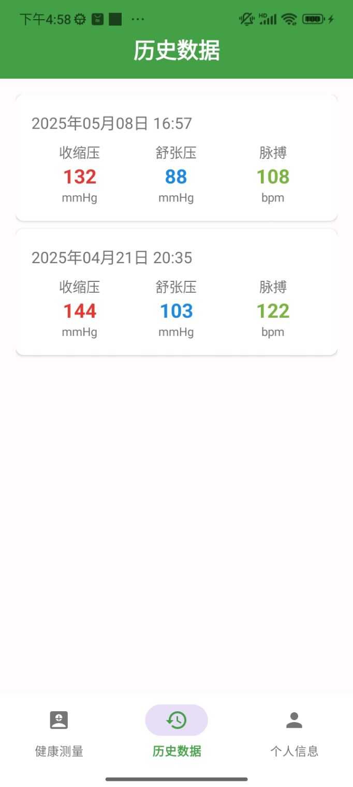
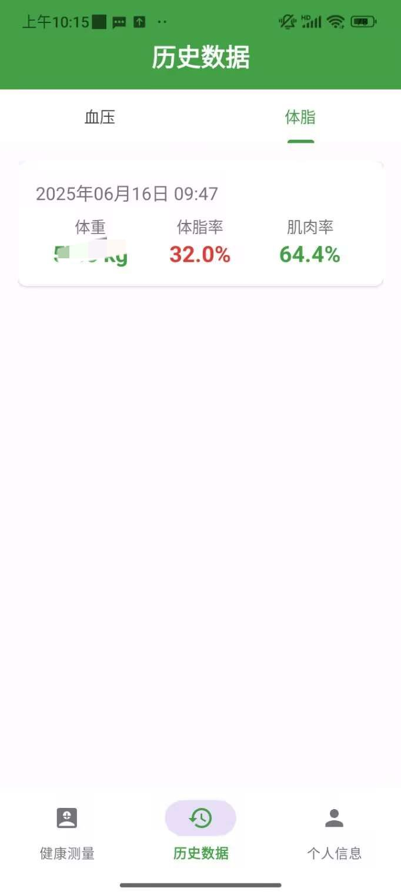
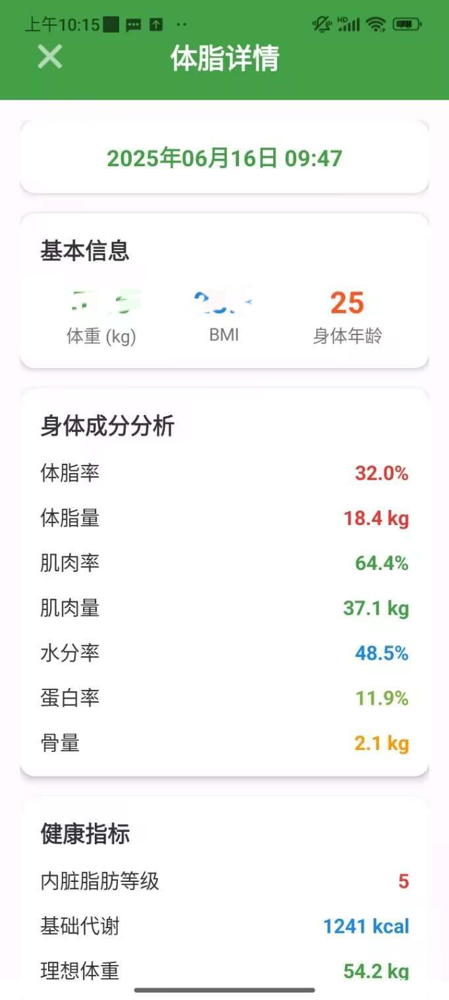
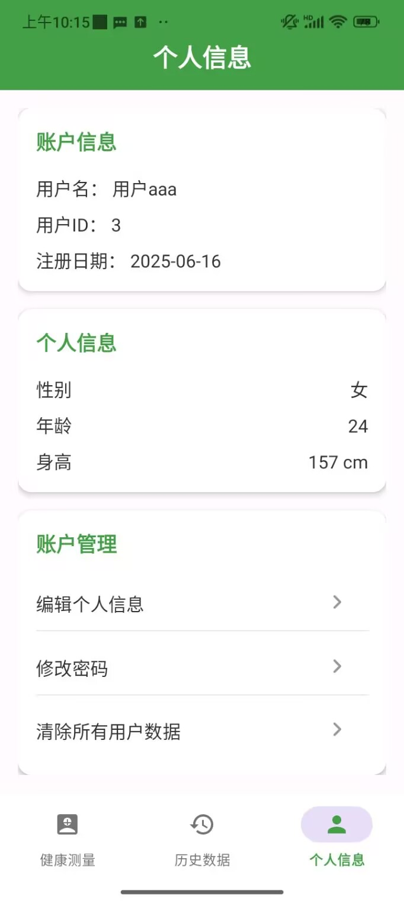

# Body Health App

这是一个健康监测应用，支持通过蓝牙连接上臂电子血压计和八电极秤，实时获取、展示和存储用户的血压及身体成分数据。

## 功能特性
- 蓝牙自动检测目标设备连接
- 实时数据展示
- 数据存储与清除
- 用户注册与登录
- 账户信息管理

## 截图展示

这里是应用的部分截图：

    
    
    
    
    
    
    
    

