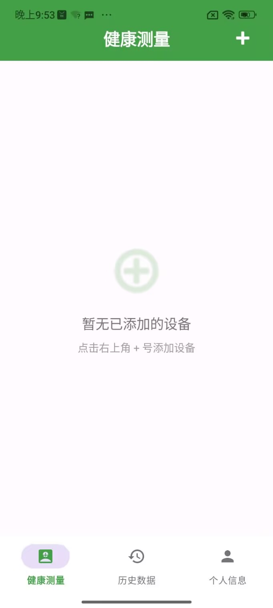

# 健康监测应用

本项目是一个基于 Android 平台开发的健康监测应用，支持通过蓝牙连接上臂电子血压计（BM100B）和八电极体脂秤（AiLink），实时获取、展示、分析和存储用户的血压及身体成分数据。

## 功能特性

### 设备连接管理
- 蓝牙设备搜索与自动配对
- 支持多类型健康设备添加
- 简洁直观的设备管理界面

### 实时数据监测
- 血压数据：收缩压、舒张压、脉搏实时显示
- 体脂分析：体重、BMI、体脂率、肌肉率等十余项指标
- 实时图表展示测量数据

### 数据存储与管理
- 可保存完整的测量历史记录
- 分类存储血压和体脂数据
- 支持滑动删除历史记录
- 详细的历史数据查看界面

### 用户系统
- 用户注册与登录验证
- 个人信息管理（性别、年龄、身高）
- 密码修改与账户安全
- 一键清除用户本地数据

### 智能算法
- 集成第三方体脂计算 SDK
- 基于用户信息精准分析
- 自动生成身体成分分析结果

### 用户体验
- 采用 Material Design 风格设计
- 底部导航栏快速切换功能模块
- 卡片式数据显示结构清晰
- 设备添加流程简洁高效

## 截图展示

这里是应用的部分截图：

    
    
    
    
    
    
    
    

